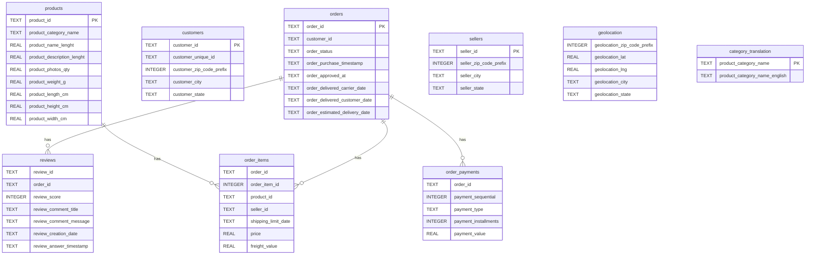

# E-commerce ML Platform

End-to-end machine learning project built on real e-commerce data. It goes
from a relational database and SQL analysis to predictive models, a deep
learning model for customer-review sentiment, and a deployed web app.

## Problem statement
Online stores generate large amounts of order and customer data. This project
turns that raw data into useful predictions: it estimates whether an order will
be delivered late and analyzes the sentiment of customer reviews, exposing both
through a simple web interface.

## Dataset
Brazilian E-Commerce Public Dataset by Olist (Kaggle) — a real, anonymized set
of ~100k orders with products, customers, delivery dates, and written reviews.

## Roadmap
- [x] Phase 0 — Problem definition and data collection
- [x] Phase 1 — Relational database design and SQL analysis
- [x] Phase 2 — Exploratory data analysis
- [ ] Phase 3 — Machine learning: delivery-delay prediction
- [ ] Phase 4 — Deep learning: review sentiment (NLP)
- [ ] Phase 5 — Web app (Streamlit)
- [ ] Phase 6 — Deployment (Hugging Face Spaces)
- [ ] Phase 7 — Documentation and responsible-AI notes

## Tech stack
Python · SQLite · pandas · scikit-learn · PyTorch · Streamlit · Git & GitHub

## Status
🚧 In progress — started September 2026.

## Database Design

The database is built with SQLite and contains 9 related tables modeling a real e-commerce operation. Primary keys uniquely identify records where the data allows it (orders, customers, products, sellers, and category translations). Foreign keys formalize the relationships between tables: reviews, order items, and payments all reference their parent order, and order items also reference the product catalog.

Some tables intentionally omit a single-column primary key, reflecting the real structure of the data: an order can have several items, payments, or reviews, so columns like `order_id` legitimately repeat in those tables. This is a deliberate design decision based on the actual data rather than an oversight.

## Exploratory Data Analysis

An exploratory analysis of the dataset ([notebook here](notebooks/02_exploratory_analysis.ipynb)) surfaced several patterns that shape the modeling phases:

- **Review scores are highly imbalanced** — most orders receive 5 stars, so the sentiment model will need to account for this skew.
- **Only 8.11% of delivered orders arrive late.** This imbalance means accuracy alone is a misleading metric, and the delay-prediction model will be evaluated with more suitable metrics.
- **Delivery delays strongly hurt satisfaction** — on-time orders average 4.29 stars versus 2.57 for late ones. This connects the two models: predicting delays helps anticipate unhappy customers.
- **Order volume grew through 2017 and stabilized in 2018**, with the apparent drop at the end reflecting the end of the dataset rather than a real decline.
- **Top categories** are home, health & beauty, and sports & leisure, indicating a general-purpose store.
