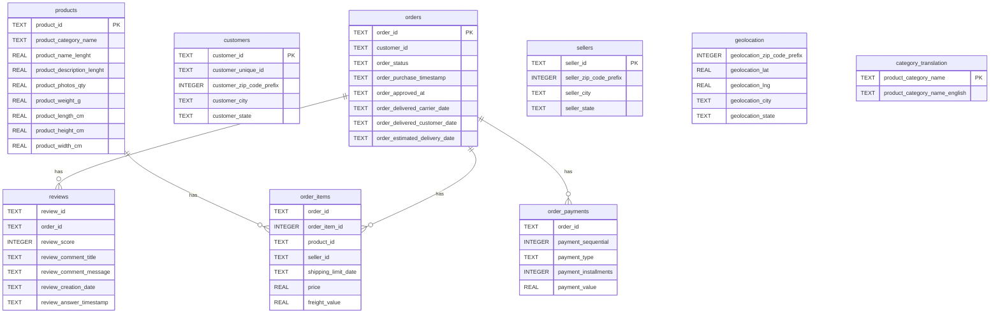

# Entity-Relationship Diagram

```mermaid
erDiagram
    orders {
        TEXT order_id PK
        TEXT customer_id
        TEXT order_status
        TEXT order_purchase_timestamp
        TEXT order_approved_at
        TEXT order_delivered_carrier_date
        TEXT order_delivered_customer_date
        TEXT order_estimated_delivery_date
    }
    customers {
        TEXT customer_id PK
        TEXT customer_unique_id
        INTEGER customer_zip_code_prefix
        TEXT customer_city
        TEXT customer_state
    }
    reviews {
        TEXT review_id
        TEXT order_id
        INTEGER review_score
        TEXT review_comment_title
        TEXT review_comment_message
        TEXT review_creation_date
        TEXT review_answer_timestamp
    }
    products {
        TEXT product_id PK
        TEXT product_category_name
        REAL product_name_lenght
        REAL product_description_lenght
        REAL product_photos_qty
        REAL product_weight_g
        REAL product_length_cm
        REAL product_height_cm
        REAL product_width_cm
    }
    order_items {
        TEXT order_id
        INTEGER order_item_id
        TEXT product_id
        TEXT seller_id
        TEXT shipping_limit_date
        REAL price
        REAL freight_value
    }
    sellers {
        TEXT seller_id PK
        INTEGER seller_zip_code_prefix
        TEXT seller_city
        TEXT seller_state
    }
    order_payments {
        TEXT order_id
        INTEGER payment_sequential
        TEXT payment_type
        INTEGER payment_installments
        REAL payment_value
    }
    geolocation {
        INTEGER geolocation_zip_code_prefix
        REAL geolocation_lat
        REAL geolocation_lng
        TEXT geolocation_city
        TEXT geolocation_state
    }
    category_translation {
        TEXT product_category_name PK
        TEXT product_category_name_english
    }
    orders ||--o{ reviews : has
    products ||--o{ order_items : has
    orders ||--o{ order_items : has
    orders ||--o{ order_payments : has
```
